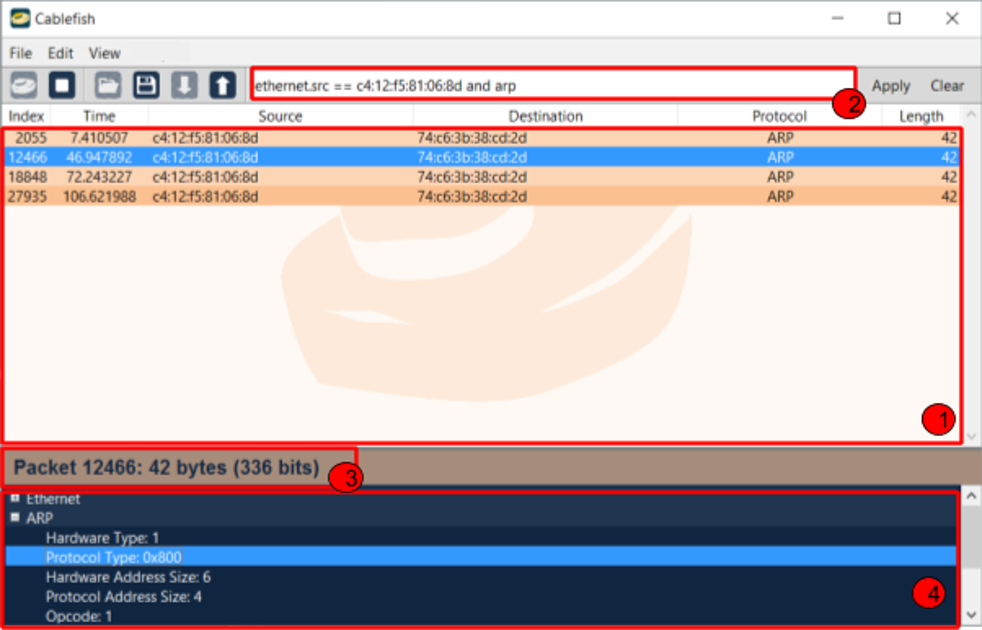

<p padding="0" align="center"> </p>

# A network traffic sniffer & analyzer. It lets you inspect what's happening on your network by protocols.  
## Features:
* Sniff network packets and view them
* Inspect packets' headers and fields
* Filter packets by protocols and fields
* Save captured data and view it using `.cf` files
* View and export data to `.pcap` files 

## How to use
_This project is developed in Python 2.7 and requires it to run_
### Interface:


1. A list of the packets sniffed in this session. View general information for each packet. Click on a packet to inspect it (3-4)
1. The filter bar. Only packets matching this filter will appear in (1)
1. Displays information about the selected packet
1. Displays the content of the selected packet, organized by protocols and fields

### The toolbar:


**Tools from left to right:**
1. Start a new sniffing session
1. Stop session
1. Open a previous session (`.cf` file)
1. Save session (in a `.cf` file)
1. Export session to a `.pcap` file
1. Import a `.pcap` file
1. Edit packet filter
1. Apply packet filter
1. Clear packet filter

### The filter:
* Filter by protcol:


In this example, only packets that contain the Ethernet protocol will appear
* Filter by field:


Here, Only packets that contain the TCP protocol and their value of the `src` field is 433 will appear
* _For network protocols that have source & destination fields (like Ethernet and TCP), Cablefish has a special field named `conversation_id`, that allowes you to filter packets by both the source and the destination_
* **The following operators are supported**:
```python
not, and, or, ==, !=, <, >, <=, >=, ()
```
* Ethernet addresses in the following format are supported: `AA:11:22:33:44:55`
* IP addresses in the following format are supported: `255.255.255.255`

### Specify new network protocols:
**Cablefish stores protocol structure information in JSON files**
* These files specify the structure of the headers and tell Cablefish how to parse the byte data of packets
```json
  "using": ["types.json", "ipv4.json"],
  "include_modules": ["tostr", "util"],

  "protocol": {
      "id": "udp",
      "name": "UDP",
      "parent": "ipv4",
      "protocol": 17,
      "header": [
        {"id": "src", "name": "Source", "size": 2, "type": "int"},
        {"id": "dst", "name": "Destination", "size": 2, "type": "int"},
        {"id": "length", "name": "Length", "size": 2, "type": "int"},
        {"id": "checksum", "name": "Checksum", "size": 2, "type": "int", "f_str": "tostr.inttohexstr"}
      ],
      "endpoints": ["src", "dst"],
      "payload": {"f_func": "util.udp_payload", "key": "port"}
```
* The `using` tag tells the parser to also include the following JSON files
* The `include` tag tells the parser to import the following Python modules, when the protocol needs special code to be parsed
* The `protocol` tag specifies the strucutre of the protocol itself:
  * The `id` tag is the network ID of this protocol
  * The `name` tag is the display name of this protocol
  * The `header` tag is a list, its items correspond to the fields of the header, and contain the ID, display name, byte size and type of the fields. 
  Fields can also have special prasing functions (`f_parse`) and toString functions (`f_str`)
  * The `endpoints` tag is a 2-long list that specify the source & destination fields of the protocol if it has any (so Cablefish will be able to detect conversaions)
  * The `payload` tag points to a function that parses the payload of the protocol
